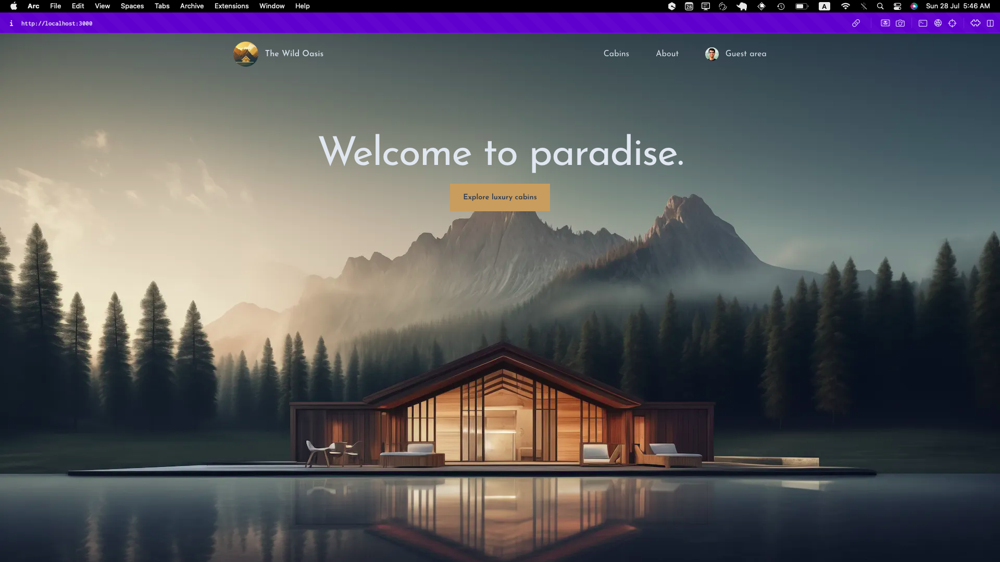

# The-Wild-Oasis-Website

This repository contains the source code for a client management application for [the-wild-oasis](https://github.com/AmrMustafa282/the-wild-oasis) project developed as application for Jonas React course. The application allows client manage reservations actions reserve, edit,and delete, explore cabins existing on the hotel, allow client to manage their data like the country and nationalID.

## Key Features

- **Authentication & Authorization**: Create account, Sign-in with google and upadte your data.
- **Explore Cabins**: see all cabins and their details , filter them to get good result and yet reserve a cabin.
- **Manage Reservations**: Create a new reservation, edit it and even delete it.
- **Profile**: manage client data like country and national ID.

## Tech Stack

- **Back-end**: Supabase for robust back-end support.
- **Front-end**: Next.js @14 for SSR and CSR.
- **Tools**: 
  - **Tailwindc**: for styling and write css utilities in the same file
  - **Auth.js**: for authentication and authorization
  - **date-fns**: provide some good date functions

## Getting Started

1. **Clone the repository**: `git clone https://github.com/AmrMustafa282/the-wild-oasis-website`
2. **Install dependencies**: `npm install`
3. **Start the development server**: `npm run dev`
4. **Open the application**: Visit `http://localhost:3000` in your browser.

## Contributing

Contributions are welcome! If you'd like to contribute to this project, please follow these steps:

1. Fork the repository
2. Create your feature branch (`git checkout -b feature/YourFeature`)
3. Commit your changes (`git commit -am 'Add some feature'`)
4. Push to the branch (`git push origin feature/YourFeature`)
5. Open a pull request

## License

This project is licensed under the MIT License - see the [MTI](LICENSE) file for details.

## Acknowledgements

- This project was developed as part application on @jonasschmedtmann react course.
- Special thanks to the contributors and maintainers of the technologies used in this project.

Feel free to reach out with any questions or feedback!